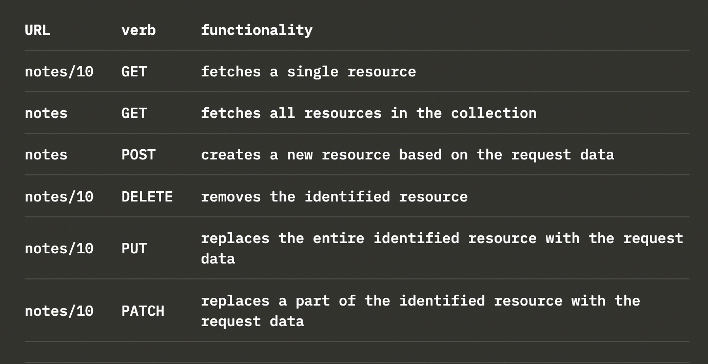

# Components

- Never define components inside of another component
- A state update in React happens asynchronously, i.e. not immediately but "at some point" before the component is rendered again

# States

- We must never mutate states directly in React

# Hooks

- `useState()` as well as the `useEffect()` must not be called from inside of:
  - a loop
  - a conditional expression
  - any place that is not a function defining a component
- This ensures that the hooks are always called in the same order

# Effect Hooks

- In React, side effects are not predictable because they are actions which are performed with the "outside world." We perform a side effect when we need to reach outside of our React components to do something. Performing a side effect, however, will not give us a predictable result.
- Think about if we were to request data (like blog posts) from a server that has failed and instead of our post data, gives us a 500 status code response.
- The Effect Hook lets you perform side effects on function components. Data fetching, setting up a subscription, and manually changing the DOM in React components are all examples of side effects.
- The effect hook function takes 2 arguments, a callback (the effect itself) and an array:
  - The callback will be called _after_ the component renders. In this function, we can perform our side effects or multiple side effects if we want.
  - The second argument is an array, called the dependencies array. What this array will do is it will check and see if a value (in this case name) has changed between renders. If so, it will execute our use effect function again. Passing an empty array [] means the effect will run only once when the component has rendered the first time.

# Rendering collections

- Each item must have a key. It's not recommended to use array index as keys

# Promise

- A promise is an object that represents an asynchronous operation. A promise can have three distinct states:

  1. The promise is pending: It means that the final value (one of the following two) is not available yet.
  2. The promise is fulfilled: It means that the operation has been completed and the final value is available, which generally is a successful operation. This state is sometimes also called resolved.
  3. The promise is rejected: It means that an error prevented the final value from being determined, which generally represents a failed operation.

# Thinking in React

- Create individual components that are as independent and reusable as possible => HTML, CSS, JS all in one component

# REST

- Representational State Transfer introduced in 2000 by Roy Fielding
- Interfaces that are intended for programmatic use
- When applied to web services, we take a more narrow view by only concerning oursleves with how RESTful APIs are typically understood in web apps
- In REST terminology, we refer to individual data objects as _resources_
- Every resource has a unique address associated with it - its URL
  - One convention for creating unique addresses is to combine the name of the resource type with the resource's unique identifier.
  - For example: root URL is _www.example.com/api_
  - If we define the resource type of note to be notes, then the address of a note resource with the identifier 10, has the unique address _www.example.com/api/notes/10_
  - The URL for the entire collection of all note resources is _www.example.com/api/notes_
- We can execute different operations on the resources, defined by HTTP verb
  

# HTTP standards

- _safety_:
  - The executing request must not cause any side effects on the server.
    - Database must not change as a result of the request.
    - The response must only return data that already exists on the server.
  - GET and HEAD ought to be considered "safe".
    - HEAD should work exactly like GET but it does not return anything but the status code and response headers.
- _idempotency_:
  - the side-effects of N > 0 identical requests is the same as for a single request.
  - The methods GET, HEAD, PUT and DELETE share this property.
- POST is the only HTTP request type that is neither _safe_ nor _idempotent_.

# Express

- In express, routes get _request_ and _response_ objects that have information about how to process the request and how to render the response
  - _request_ will have information like query parameters (the part after the & in a URL), a body if you need to get form POST info, accepted language or encoding information, etc.
  - _response_ is ultimately responsible for deciding what data (typically a string of HTML or JSON, etc) gets sent to the client.
- Between those 2 endpoints, we might need to do some stuff: hit a database, authenticate a user, validate a token, select display text from a localization tool, etc. Most of the time, those processes are repeated on every route and every request. In order to keep them flexible, reusable, ordered and so on, each type of processing can be broken out into a _Middleware_ function.

# Middleware

- In general, it's a software that provides services to other software by extending what's provided by the level below it.
- In Express, it's a function that has access to the _req_, _res_, objects and the _next()_ function.
- In essence, middleware sits in between the client and the final handling of the request in your server and processes it.
  - Middleware functions have to be taken into use before routes if we want them to be executed before the route event handlers are called.
  - Simply place all of the middleware needed for a request right before the final "endware" (ie, the final function that actually sends a response).
  - Since the middleware has access to both the request and response objects, and the ability to continue or halt the middleware processing from one function to the next, it's easy to attach information that will be used further on down the line or bail out entirely when something goes wrong.
  - Middleware functions are called in the order that they're taken into use with the express server object's use() method.

# Same-origin policy and Cross-Origin Resrouce Sharing (CORS)

- Same-origin policy is a set of rules implemented by _browsers_ to make it prevent a website from one URL's origin to access resources on a website from another URL's origin.
- A URL's origin is defined by the combination of protocol (AKA scheme), hostname, and port.

  ````
  http://example.com:80/index.html

  protocol: http
  host: example.com
  port: 80```
  ````

- If the resource is fetched using a URL that doesn't share the same origin(scheme, host, port) as the source HTML, the browser will have to check the Access-Control-Allow-origin response header. If it contains \* or the URL of the source HTML, the browser will process the response, otherwise the browser will refuse to process it and throw an error.
- CORS is a mechanism that allows restricted resources (e.g. fonts) on a web page to be requested from another domain outside the domain from which the first resource was served. A web page may freely embed cross-origin images, stylesheets, scripts, iframes, and videos. Certain "cross-domain" requests, notably Ajax requests, are forbidden by default by the same-origin security policy.
- Practically, in Express we solve this issue by using the cors middleware: `npm install cors`

# npm

- It's customary to run tasks as npm scripts
